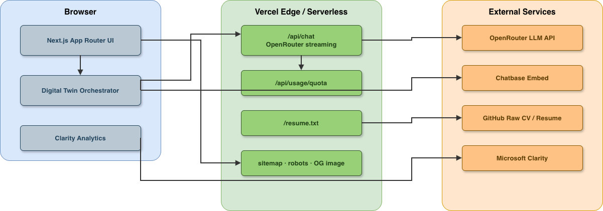

# Qasir Mehmood — Senior Full-Stack Developer & Azure AI Engineer

[](https://www.qasir.co.uk)
[](https://nextjs.org)
[](https://react.dev)
[](https://www.typescriptlang.org)
[](https://tailwindcss.com)
[](https://playwright.dev)
[](https://vercel.com)
[](https://www.sanity.io)

**Production-grade developer portfolio** showcasing 12+ years of **Full-Stack**, **Azure AI**, and **cloud-native** engineering — built with **Next.js 16 App Router**, **React 19**, **TypeScript**, and an **LLM-powered AI Digital Twin**.

> Microsoft Certified **Azure AI Engineer Associate (AI-102)** · **Next.js** · **React** · **TypeScript** · **Python/FastAPI** · **Generative AI** · **RAG** · **Agentic AI** · **MCP** · **Terraform** · **GitHub Actions** · **WCAG 2.1**

**Live:** [qasir.co.uk](https://www.qasir.co.uk) · **Repo:** [github.com/qasirdev/qasir-profile-ai](https://github.com/qasirdev/qasir-profile-ai)

---

## Overview

A modern, recruiter- and ATS-friendly portfolio platform that combines premium UI/UX with real production patterns: streaming AI chat, signed quota management, remote CV/resume delivery, **Sanity CMS blog**, structured SEO, analytics, and automated CI/CD.

Designed for **recruiters**, **hiring managers**, and **technical reviewers** to quickly assess skills, experience, and engineering quality — while demonstrating enterprise-grade frontend architecture and applied AI integration.

---

## Key Features

| Area | Capabilities |
|------|-------------|
| **AI Digital Twin** | Streaming LLM chat via **OpenRouter** with model fallback chain; optional **Chatbase** embed with auto-provider orchestration |
| **Quota & Cost Control** | HMAC-signed visit/day quotas, conversation history trimming, monthly Chatbase budget mirroring |
| **Resume & CV** | `/resume` page, `/resume.txt` plain-text endpoint, PDF download — sourced from GitHub raw URLs (update CV without redeploying) |
| **Blog (Sanity CMS)** | Headless blog at `/blogs` with GROQ fetching, Portable Text rendering, categories, authors, SEO fields, and embedded Studio at `/studio` |
| **SEO & Discoverability** | JSON-LD Person schema, dynamic OG image, sitemap (includes blog posts), robots.txt, keyword-rich metadata, canonical URLs |
| **Analytics** | Microsoft Clarity session analytics with custom event tracking |
| **Accessibility** | Skip navigation, semantic HTML, WCAG 2.1 patterns, keyboard-friendly UI |
| **Design System** | ShadCN UI + Radix primitives, Framer Motion, dark/light themes, glassmorphism, responsive mobile-first layout |
| **Content Sections** | Hero, About, Career Timeline, Skills, Portfolio, Blog, AI Chat, Contact, SEO keywords |
| **Quality Assurance** | Vitest unit tests, Playwright E2E, GitHub Actions CI on every push/PR |

---

## Architecture



---

## Tech Stack

### Frontend
- **Next.js 16** — App Router, Server Components, Route Handlers, dynamic metadata
- **React 19** — Modern concurrent rendering
- **TypeScript 5** — Strict, type-safe development
- **Tailwind CSS 4** — Utility-first styling with design tokens
- **ShadCN UI / Radix UI** — Accessible component primitives
- **Framer Motion** — Micro-interactions and scroll animations
- **React Hook Form + Zod** — Validated forms
- **Lucide React** — Icon system

### Backend & AI
- **OpenRouter API** — Multi-model LLM routing with fallback chain
- **Chatbase** — Managed AI widget (provider failover)
- **Streaming SSE** — Real-time token streaming for chat responses
- **Signed cookie quotas** — Per-visit and per-day rate limiting

### Content (Blog)
- **Sanity CMS v6** — Headless content platform with embedded Studio at `/studio`
- **GROQ + next-sanity** — Server-side blog fetching with ISR revalidation
- **Portable Text** — Rich blog body with code blocks, images, and links
- **@sanity/code-input** — Syntax-highlighted code blocks in Studio

### DevOps & Quality
- **GitHub Actions** — CI pipeline (`npm ci` + `npm run build`)
- **Vercel** — Production hosting with preview deployments
- **Vitest + Testing Library** — Unit and component tests
- **Playwright** — End-to-end browser tests
- **ESLint** — Code quality (Next.js config)

### Observability & SEO
- **Microsoft Clarity** — Heatmaps and session replay
- **JSON-LD** — Structured Person schema for search engines
- **Core Web Vitals** — Performance-first asset loading

---

## Project Structure

```
qasir-profile/
├── .github/workflows/ci.yml    # GitHub Actions CI
├── cv/                         # CV markdown & PDF (GitHub raw source)
├── docs/                       # Deployment, Sanity CMS, and operational guides
├── public/                     # Static assets
├── sanity.config.ts            # Sanity Studio v6 configuration
├── src/
│   ├── app/                    # App Router pages & API routes
│   │   ├── api/chat/           # OpenRouter streaming endpoint
│   │   ├── api/usage/          # Quota & usage tracking
│   │   ├── blogs/              # Blog listing & post pages (Sanity CMS)
│   │   ├── studio/             # Embedded Sanity Studio
│   │   ├── resume/             # Resume page
│   │   └── resume.txt/         # Plain-text resume endpoint
│   ├── components/             # UI sections, blog components & Digital Twin
│   ├── sanity/                 # Sanity schema, GROQ queries, client
│   └── lib/                    # AI, analytics, SEO, resume logic
├── tests/                      # Playwright E2E specs
├── .env.example                # Environment variable reference
└── .env.local.example          # Sanity CMS variables
```

---

## Getting Started

### Prerequisites

- **Node.js 24+** (GitHub Actions runners; Node 20 is deprecated on `ubuntu-latest`)
- **npm**
- OpenRouter API key (for AI Digital Twin)
- Sanity project ID (for blog — see [docs/SANITY_SETUP_GUIDE.md](docs/SANITY_SETUP_GUIDE.md))
- Optional: Chatbase agent ID, Microsoft Clarity project ID

### Installation

```bash
git clone https://github.com/qasirdev/qasir-profile-ai.git
cd qasir-profile-ai
npm install
cp .env.example .env.local
```

### Environment Variables

| Variable | Required | Description |
|----------|----------|-------------|
| `OPENROUTER_API_KEY` | Yes | OpenRouter API key for AI chat |
| `OPENROUTER_BASE_URL` | No | Defaults to `https://openrouter.ai/api/v1` |
| `LLM_PRIMARY_MODEL` | No | Primary LLM model ID |
| `LLM_OPENROUTER_MODELS` | No | Comma-separated fallback model chain |
| `DIGITAL_TWIN_MAX_QUESTIONS_PER_VISIT` | No | Per-session question limit (0 = unlimited) |
| `DIGITAL_TWIN_MAX_QUESTIONS_PER_DAY` | No | Daily question limit (0 = unlimited) |
| `DIGITAL_TWIN_MAX_HISTORY_TURNS` | No | Conversation history cap for token savings |
| `NEXT_PUBLIC_CHATBASE_EMBED_ID` | No | Chatbase widget agent ID |
| `NEXT_PUBLIC_DIGITAL_TWIN_FORCE_PROVIDER` | No | `auto` \| `chatbase` \| `openrouter` |
| `DIGITAL_TWIN_CHATBASE_MONTHLY_BUDGET` | No | Monthly Chatbase credit threshold |
| `NEXT_PUBLIC_CLARITY_PROJECT_ID` | No | Microsoft Clarity analytics ID |
| `NEXT_PUBLIC_APP_URL` | Yes | Site URL (`http://localhost:3000` locally) |
| `NEXT_PUBLIC_CV_URL` | No | GitHub raw PDF URL for CV download |
| `NEXT_PUBLIC_RESUME_TEXT_URL` | No | GitHub raw markdown URL for `/resume.txt` |
| `NEXT_PUBLIC_SANITY_PROJECT_ID` | Yes (blog) | Sanity project ID for `/blogs` content |
| `NEXT_PUBLIC_SANITY_DATASET` | No | Defaults to `production` |
| `NEXT_PUBLIC_SANITY_API_VERSION` | No | Defaults to `2026-06-01` |
| `SANITY_API_TOKEN` | No | Server-side token for draft/preview (optional) |

Blog setup: [docs/SANITY_SETUP_GUIDE.md](docs/SANITY_SETUP_GUIDE.md)

### Development

```bash
npm run dev
```

Open [http://localhost:3000](http://localhost:3000).

### Production Build

```bash
npm run build
npm run start
```

---

## Testing

```bash
# Unit & component tests (Vitest)
npm run test

# Vitest UI
npm run test:ui

# End-to-end tests (Playwright)
npm run test:e2e

# Playwright UI mode
npm run test:e2e:ui
```

---

## CI/CD

**GitHub Actions** runs on every push and pull request to `main`:

1. Checkout code
2. Setup Node.js 24 with npm cache
3. `npm ci`
4. `npm run build`

**Vercel** deploys automatically from GitHub — preview URLs on PRs, production on `main`.

Full deployment walkthrough: [docs/vercel-deployment-guide.md](docs/vercel-deployment-guide.md)

---

## API Routes

| Endpoint | Method | Purpose |
|----------|--------|---------|
| `/api/chat` | POST | Streaming AI Digital Twin (OpenRouter) |
| `/api/usage/quota` | GET | Read current quota status |
| `/api/usage/quota/reset-visit` | POST | Reset per-visit quota |
| `/api/usage/account` | GET | Usage account summary |
| `/api/usage/chatbase-message` | POST | Chatbase mirror counter |
| `/resume.txt` | GET | Plain-text resume (ATS/recruiter friendly) |
| `/blogs` | GET | Blog listing (Sanity CMS) |
| `/blogs/[slug]` | GET | Individual blog post (Sanity CMS) |
| `/studio` | GET | Embedded Sanity Studio (content management) |
| `/llms.txt` | GET | LLM/agent crawler index ([llmstxt.org](https://llmstxt.org/)) |
| `/sitemap.xml` | GET | Dynamic sitemap |
| `/robots.txt` | GET | Crawler directives |
| `/opengraph-image` | GET | Dynamic social share image |

---

## Performance & Standards

- **Core Web Vitals** — Optimized fonts (Geist), code splitting, lazy loading
- **SEO** — Meta tags, Open Graph, Twitter cards, JSON-LD, canonical URLs
- **Accessibility** — Skip links, semantic landmarks, ARIA patterns, keyboard navigation
- **Security** — API keys server-side only; signed quota cookies; no secrets in client bundle
- **Maintainability** — TypeScript strict mode, modular lib layer, test coverage on critical paths

---

## Skills Demonstrated

**Languages:** JavaScript, TypeScript, Python  
**Frontend:** React, Next.js, Tailwind CSS, Redux, GraphQL  
**Backend:** Node.js, FastAPI, REST APIs, OAuth 2.0, JWT  
**Content:** Sanity CMS, Portable Text, GROQ, headless CMS  
**Cloud & DevOps:** Azure, AWS, Docker, Terraform, Vercel, GitHub Actions  
**AI/ML:** Azure OpenAI, Generative AI, RAG, Agentic AI, LLM Integration, MCP, Prompt Engineering  
**Databases:** PostgreSQL, MongoDB, MySQL, Prisma  
**Testing:** Jest, Vitest, Playwright, React Testing Library, Cypress  
**Practices:** Microservices, CI/CD, WCAG 2.1, Agile/Scrum, TDD

---

## Browser Support

| Browser | Minimum Version |
|---------|----------------|
| Chrome / Edge | 90+ |
| Firefox | 88+ |
| Safari | 14+ |
| Mobile | iOS Safari, Android Chrome |

---

## License

This project is licensed under the [MIT License](LICENSE).

---

## Contact

| | |
|---|---|
| **Email** | [qasirdev@gmail.com](mailto:qasirdev@gmail.com) |
| **LinkedIn** | [linkedin.com/in/qasir](https://www.linkedin.com/in/qasir) |
| **Website** | [qasir.co.uk](https://www.qasir.co.uk) |
| **GitHub** | [github.com/qasirdev](https://github.com/qasirdev) |

---

Built by **Qasir Mehmood** — Senior Full-Stack Developer & Azure AI Engineer
