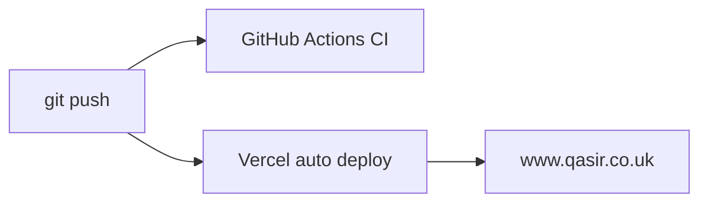
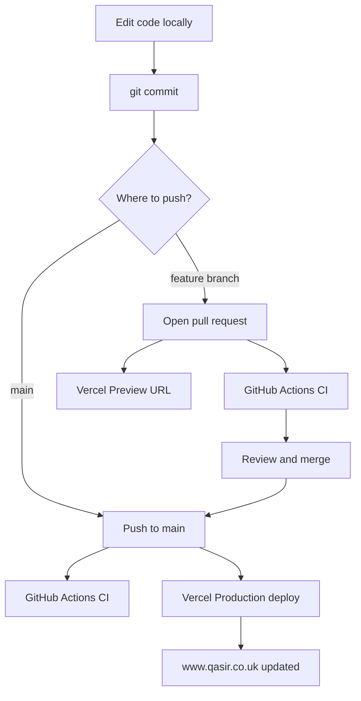

# Vercel Deployment Guide — qasir.co.uk

Step-by-step guide to deploy this Next.js portfolio to [Vercel Hobby](https://vercel.com/pricing) (free) with automated **GitHub Actions CI** and **Vercel CD**, using the new repo [`qasirdev/qasir-profile-ai`](https://github.com/qasirdev/qasir-profile-ai).

---

## Table of contents

1. [Introduction](#1-introduction)
2. [Prerequisites](#2-prerequisites)
3. [Glossary](#3-glossary)
4. [Repository strategy](#4-repository-strategy)
5. [What you are deploying](#5-what-you-are-deploying)
6. [CI/CD overview](#6-cicd-overview)
7. [Phase 1 — Local pre-deploy checklist](#phase-1--local-pre-deploy-checklist)
8. [Phase 2 — Create GitHub repo and push](#phase-2--create-github-repo-and-push)
9. [Phase 3 — Add GitHub Actions CI](#phase-3--add-github-actions-ci)
10. [Phase 4 — Create Vercel project](#phase-4--create-vercel-project)
11. [Phase 5 — Environment variables on Vercel](#phase-5--environment-variables-on-vercel)
12. [Phase 6 — Verify Vercel preview URL](#phase-6--verify-vercel-preview-url)
13. [Phase 7 — Connect GoDaddy domain](#phase-7--connect-godaddy-domain)
14. [Phase 8 — Cutover from old site](#phase-8--cutover-from-old-site)
15. [Phase 9 — Daily workflow after go-live](#phase-9--daily-workflow-after-go-live)
16. [Environment variable reference](#environment-variable-reference)
17. [Vercel Hobby limits](#vercel-hobby-limits)
18. [Troubleshooting](#troubleshooting)
19. [Post-deploy checklist](#post-deploy-checklist)
20. [Success criteria](#success-criteria)

---

## 1. Introduction

### What is Vercel?

Vercel is a hosting platform built for Next.js. You connect a GitHub repository; every push automatically builds and deploys your site.

### Why Vercel Hobby?

| Feature | Hobby plan |
|---------|------------|
| Price | **$0 / free forever** |
| HTTPS | Included (automatic certificates) |
| CDN | Global, included |
| CI/CD from GitHub | Included |
| Serverless functions | Included (needed for AI chat API) |

Hobby is suitable for a personal portfolio. See [Vercel pricing](https://vercel.com/pricing) for full details.

### Legacy vs new repo

| Repository | Purpose |
|------------|---------|
| [qasirdev/qasir-profile](https://github.com/qasirdev/qasir-profile) | **Legacy** — older site, Docker, Jenkins, AWS EC2 |
| **qasirdev/qasir-profile-ai** (new) | **This codebase** — Next.js 16 + AI Digital Twin → Vercel |

Leave the legacy repo unchanged. All new work goes to `qasir-profile-ai`.

---

## 2. Prerequisites

Before you start, make sure you have:

- [ ] A [GitHub](https://github.com) account (`qasirdev`)
- [ ] A [Vercel](https://vercel.com) account (sign in with GitHub)
- [ ] GoDaddy login for `qasir.co.uk` DNS
- [ ] An [OpenRouter](https://openrouter.ai) API key (for AI Digital Twin chat)
- [ ] [Node.js 24](https://nodejs.org) installed locally
- [ ] Git installed locally

---

## 3. Glossary

| Term | Meaning |
|------|---------|
| **Deployment** | Publishing a built version of your site so visitors can access it |
| **CI (Continuous Integration)** | Automated checks (build, lint) on every push — GitHub Actions |
| **CD (Continuous Deployment)** | Automatic deploy when code is pushed — Vercel Git integration |
| **Preview deploy** | Temporary URL for a pull request (`*.vercel.app`) |
| **Production deploy** | Live site on `www.qasir.co.uk` |
| **Environment variable** | Secret or config value stored on Vercel (not in git) |
| **DNS** | Settings that tell browsers where `qasir.co.uk` points |
| **CNAME** | DNS record that maps a subdomain (e.g. `www`) to another host |
| **A record** | DNS record that maps apex domain (`@`) to an IP address |
| **Apex domain** | Root domain without `www` — `qasir.co.uk` |
| **SSL / HTTPS** | Encrypted connection; Vercel provides certificates automatically |

---

## 4. Repository strategy

```
qasir-profile/          ← local folder (this project)
    ↓ git push
github.com/qasirdev/qasir-profile-ai
    ↓ Vercel Git integration
www.qasir.co.uk         ← production URL
```

**Vercel root directory:** `.` (repo root — `package.json` is at the top level)

---

## 5. What you are deploying

| Item | Detail |
|------|--------|
| Framework | Next.js 16 (App Router) |
| Build command | `npm run build` |
| Node.js version | **22.x** (Sanity Studio v6) |
| API routes | 5 serverless routes under `src/app/api/*` (AI chat + quotas) |
| Pages | `/`, `/blogs`, `/blogs/[slug]`, `/studio`, `/resume`, `/resume.txt`, `/llms.txt`, `/robots.txt`, `/sitemap.xml` |
| Database | None (quota state uses signed cookies) |
| Blog CMS | **Sanity CMS** — content fetched via GROQ; images from `cdn.sanity.io` |
| CV files | `cv/qasir-fullstack-cv.md`, `cv/qasir-mehmood-cv.pdf` (GitHub raw URLs) |
| External services | OpenRouter (AI), **Sanity** (blog), optional Chatbase, optional Microsoft Clarity |

**Important:** This is **not** a static export. The AI chat requires Vercel serverless functions.

---

## 6. CI/CD overview

Two layers work together:

### Layer 1 — Vercel (deployment)

| Event | What happens |
|-------|--------------|
| Push to `main` | Build + deploy to **Production** |
| Open/update PR | Build + deploy to **Preview** URL |
| Merge PR to `main` | Auto-promote to Production |

No manual deploy button needed after initial setup.

### Layer 2 — GitHub Actions (quality checks)

Runs `npm ci` and `npm run build` on every push and pull request to `main`.



---

## Phase 1 — Local pre-deploy checklist

Run these commands from the project folder:

```bash
cd qasir-profile
npm install
cp .env.example .env.local   # if you have not already
npm run build
```

### Confirm CV assets exist

Both files should be in the repo before pushing:

```
cv/qasir-fullstack-cv.md
cv/qasir-mehmood-cv.pdf
```

### Commit all work

If you have uncommitted changes:

```bash
git add .
git status   # confirm .env is NOT listed
git commit -m "Add Next.js 16 portfolio with AI Digital Twin and CV assets"
```

**Never commit `.env`** — it contains secrets. Only `.env.example` goes in git.

### Verify build passes

A successful build lists routes including `/`, `/resume`, `/api/chat`, etc.

---

## Phase 2 — Create GitHub repo and push

### Step 2.1 — Create repository on GitHub

1. Go to [github.com/new](https://github.com/new)
2. **Owner:** `qasirdev`
3. **Repository name:** `qasir-profile-ai`
4. **Description:** `Qasir profile website with AI Digital Twin — Vercel deployment`
5. Public or Private (public = unlimited free GitHub Actions minutes)
6. **Do not** check "Add a README" (you already have one)
7. Click **Create repository**

### Step 2.2 — Push local code

```bash
cd qasir-profile
git remote add origin git@github.com:qasirdev/qasir-profile-ai.git
git push -u origin main
```

If you use HTTPS instead of SSH:

```bash
git remote add origin https://github.com/qasirdev/qasir-profile-ai.git
git push -u origin main
```

### Step 2.3 — Verify

Open [https://github.com/qasirdev/qasir-profile-ai](https://github.com/qasirdev/qasir-profile-ai) and confirm:

- [ ] Source code is visible
- [ ] `cv/` folder contains both CV files
- [ ] No `.env` file in the repo

---

## Phase 3 — Add GitHub Actions CI

Create the file `.github/workflows/ci.yml` in your repo:

```yaml
name: CI

on:
  push:
    branches: [main]
  pull_request:
    branches: [main]

jobs:
  build:
    runs-on: ubuntu-latest
    steps:
      - uses: actions/checkout@v4

      - uses: actions/setup-node@v4
        with:
          node-version: "24"
          cache: npm

      - run: npm ci
      - run: npm run build
      # - run: npm run lint   # enable after lint errors are fixed
```

Commit and push:

```bash
git add .github/workflows/ci.yml
git commit -m "Add GitHub Actions CI workflow"
git push
```

Check **GitHub → Actions** tab for a green checkmark.

> **Note:** `npm run lint` is commented out because it currently has errors in `src/lib/analytics.ts`. Enable it after fixing those errors.

### Optional — Require CI before merge

GitHub → repo **Settings → Branches → Add branch protection rule** for `main`:

- Require status checks to pass before merging
- Select the `build` job from CI

---

## Phase 4 — Create Vercel project

### Step 4.1 — Sign in and install GitHub app

1. Go to [vercel.com](https://vercel.com) and sign in with GitHub
2. When prompted, **install the Vercel GitHub App**
3. Grant access to `qasirdev/qasir-profile-ai`

### Step 4.2 — Import project

1. Click **Add New → Project**
2. Select **`qasirdev/qasir-profile-ai`**
3. Framework preset: **Next.js** (auto-detected)

### Step 4.3 — Project settings

| Setting | Value |
|---------|-------|
| Framework | Next.js |
| Root Directory | `.` |
| Build Command | `npm run build` |
| Output Directory | *(leave default)* |
| Install Command | `npm install` |

### Step 4.4 — Node.js version

After project creation:

1. **Project Settings → General → Node.js Version**
2. Set to **20.x**

### Step 4.5 — Production branch

1. **Project Settings → Git**
2. Confirm **Production Branch** = `main`

### Step 4.6 — Do not deploy yet

Add environment variables first (Phase 5), then deploy.

---

## Phase 5 — Environment variables on Vercel

Go to **Project → Settings → Environment Variables**.

### Required for Production

| Variable | Value | Sensitive? |
|----------|-------|------------|
| `OPENROUTER_API_KEY` | Your OpenRouter API key | **Yes** |
| `NEXT_PUBLIC_APP_URL` | `https://www.qasir.co.uk` | No |

### Recommended for Production

Copy from your local `.env` or use these values:

| Variable | Example value |
|----------|---------------|
| `OPENROUTER_BASE_URL` | `https://openrouter.ai/api/v1` |
| `LLM_PRIMARY_MODEL` | `openai/gpt-oss-120b:free` |
| `LLM_OPENROUTER_MODELS` | `openai/gpt-oss-120b:free,deepseek/deepseek-v4-flash` |
| `DIGITAL_TWIN_MAX_QUESTIONS_PER_VISIT` | `5` |
| `DIGITAL_TWIN_MAX_QUESTIONS_PER_DAY` | `20` |
| `NEXT_PUBLIC_CV_URL` | `https://github.com/qasirdev/qasir-profile-ai/raw/main/cv/qasir-mehmood-cv.pdf` |
| `NEXT_PUBLIC_RESUME_TEXT_URL` | `https://github.com/qasirdev/qasir-profile-ai/raw/main/cv/qasir-fullstack-cv.md` |
| `NEXT_PUBLIC_SANITY_PROJECT_ID` | Your Sanity project ID (required for `/blogs`) |
| `NEXT_PUBLIC_SANITY_DATASET` | `production` |
| `NEXT_PUBLIC_SANITY_API_VERSION` | `2026-06-01` |

See [SANITY_SETUP_GUIDE.md](./SANITY_SETUP_GUIDE.md) for Sanity project setup and CORS (`https://www.qasir.co.uk`, preview URLs).

### Optional

| Variable | When to set |
|----------|-------------|
| `NEXT_PUBLIC_CLARITY_PROJECT_ID` | If using Microsoft Clarity analytics |
| `NEXT_PUBLIC_CHATBASE_EMBED_ID` | If using Chatbase widget |
| `NEXT_PUBLIC_DIGITAL_TWIN_FORCE_PROVIDER` | `auto`, `chatbase`, or `openrouter` |
| `DIGITAL_TWIN_CHATBASE_MONTHLY_BUDGET` | Chatbase mirror threshold (default `50`) |
| `DIGITAL_TWIN_MAX_HISTORY_TURNS` | Conversation history cap (default `6`) |
| `NEXT_PUBLIC_PROFILE_IMAGE_URL` | Override default `/profile-photo.jpg` |
| `SANITY_API_TOKEN` | Server-side Sanity token for draft preview (optional) |

**Scoping:** Set Production for all. Also set Preview if you want AI chat on preview URLs.

**Sanity CORS:** Add `https://www.qasir.co.uk` and your Vercel preview domain in [sanity.io/manage](https://www.sanity.io/manage) → API → CORS origins.

Click **Deploy** after saving variables.

---

## Phase 6 — Verify Vercel preview URL

After the first deploy succeeds, Vercel gives you a URL like `qasir-profile-ai.vercel.app`.

Test these:

- [ ] Homepage loads
- [ ] Profile photo displays
- [ ] **AI Digital Twin** chat sends a message and streams a reply
- [ ] `/resume` page loads
- [ ] `/resume.txt` returns plain text
- [ ] **Download CV (PDF)** opens the PDF from GitHub
- [ ] `/robots.txt` and `/sitemap.xml` load

If the build failed, open **Deployments → latest → Build Logs** and fix the error (usually missing env var or Node version).

---

## Phase 7 — Connect GoDaddy domain

### Domain strategy

| Domain | Role |
|--------|------|
| `www.qasir.co.uk` | **Primary** — serves the site |
| `qasir.co.uk` | **Redirect** → `https://www.qasir.co.uk` |

### Step 7.1 — Add domains in Vercel

1. **Project → Settings → Domains**
2. Add `www.qasir.co.uk` → set as **Primary**
3. Add `qasir.co.uk` → accept Vercel's offer to redirect to www

Vercel shows the DNS records you need. Typical values:

| Host | Type | Value |
|------|------|-------|
| `www` | CNAME | `cname.vercel-dns.com` |
| `@` | A | `76.76.21.21` |

> Always use the **exact values shown in your Vercel dashboard**, not the table above.

### Step 7.2 — Update GoDaddy DNS

1. Log in at [godaddy.com](https://www.godaddy.com)
2. **My Products** → `qasir.co.uk` → **DNS** (or [dcc.godaddy.com/manage](https://dcc.godaddy.com/manage))
3. **Remove or edit** old records pointing to AWS EC2 / previous host
4. Add or update:

   **Record 1 — www**
   - Type: `CNAME`
   - Name: `www`
   - Value: `cname.vercel-dns.com` *(from Vercel)*
   - TTL: `600` (10 minutes) for faster propagation

   **Record 2 — apex**
   - Type: `A`
   - Name: `@`
   - Value: `76.76.21.21` *(from Vercel)*
   - TTL: `600`

5. **Save** all changes

### Step 7.3 — Wait for propagation

- DNS can take **5 minutes to 48 hours**
- Vercel Domains page shows **Valid Configuration** when ready
- SSL certificate is issued automatically

### Step 7.4 — Optional code redirect

Add a safety-net redirect in `next.config.ts` (Vercel domain redirect usually handles this):

```ts
import type { NextConfig } from "next";

const nextConfig: NextConfig = {
  async redirects() {
    return [
      {
        source: "/:path*",
        has: [{ type: "host", value: "qasir.co.uk" }],
        destination: "https://www.qasir.co.uk/:path*",
        permanent: true,
      },
    ];
  },
};

export default nextConfig;
```

Commit and push — Vercel will auto-deploy the change.

---

## Phase 8 — Cutover from old site

The live site at [qasir.co.uk](https://qasir.co.uk) currently runs on the legacy [qasir-profile](https://github.com/qasirdev/qasir-profile) stack (Docker + AWS EC2).

### Cutover order

1. ✅ Site works on `*.vercel.app` (Phase 6)
2. ✅ DNS updated in GoDaddy (Phase 7)
3. ✅ Vercel shows **Valid Configuration** for both domains
4. ✅ Visit `https://www.qasir.co.uk` — new site loads
5. ✅ Visit `https://qasir.co.uk` — redirects to www
6. ✅ AI chat works on production
7. **Stop/decommission** old EC2 instance and Jenkins pipeline
8. Optionally update legacy repo README to point to `qasir-profile-ai`
9. Submit sitemap in [Google Search Console](https://search.google.com/search-console):
   - `https://www.qasir.co.uk/sitemap.xml`

---

## Phase 9 — Daily workflow after go-live



### Typical commands

```bash
# Small fix — push directly to main
git add .
git commit -m "Fix hero section copy"
git push

# Larger change — use a branch
git checkout -b feature/new-portfolio-card
git add .
git commit -m "Add portfolio card for new project"
git push -u origin feature/new-portfolio-card
# Open PR on GitHub → review preview URL → merge
```

### Rollback without git revert

Vercel → **Deployments** → find a previous successful deploy → **⋯** → **Promote to Production**

### Update CV without redeploying the site

Edit `cv/qasir-fullstack-cv.md` or replace `cv/qasir-mehmood-cv.pdf` in the GitHub repo and push to `main`. The site fetches CV content from GitHub raw URLs (resume page revalidates hourly).

---

## Environment variable reference

Full list from `.env.example`:

| Variable | Required | Scope | Description |
|----------|----------|-------|-------------|
| `OPENROUTER_API_KEY` | **Yes** | Server | OpenRouter API key for AI chat |
| `NEXT_PUBLIC_APP_URL` | **Yes** | Public | `https://www.qasir.co.uk` in production |
| `OPENROUTER_BASE_URL` | Recommended | Server | Default: `https://openrouter.ai/api/v1` |
| `LLM_PRIMARY_MODEL` | Recommended | Server | Primary AI model |
| `LLM_OPENROUTER_MODELS` | Recommended | Server | Comma-separated fallback models |
| `DIGITAL_TWIN_MAX_QUESTIONS_PER_VISIT` | Optional | Server | Per-visit quota (default `5`) |
| `DIGITAL_TWIN_MAX_QUESTIONS_PER_DAY` | Optional | Server | Daily quota (default `20`) |
| `DIGITAL_TWIN_MAX_HISTORY_TURNS` | Optional | Server | History cap (default `6`) |
| `DIGITAL_TWIN_QUOTA_SECRET` | Optional | Server | HMAC secret for quota cookies |
| `NEXT_PUBLIC_CHATBASE_EMBED_ID` | Optional | Public | Chatbase widget ID |
| `NEXT_PUBLIC_DIGITAL_TWIN_FORCE_PROVIDER` | Optional | Public | `auto` \| `chatbase` \| `openrouter` |
| `DIGITAL_TWIN_CHATBASE_MONTHLY_BUDGET` | Optional | Server | Chatbase mirror threshold |
| `NEXT_PUBLIC_CLARITY_PROJECT_ID` | Optional | Public | Microsoft Clarity project ID |
| `NEXT_PUBLIC_PROFILE_IMAGE_URL` | Optional | Public | Defaults to `/profile-photo.jpg` |
| `NEXT_PUBLIC_CV_URL` | Recommended | Public | GitHub raw PDF URL |
| `NEXT_PUBLIC_RESUME_TEXT_URL` | Recommended | Public | GitHub raw markdown URL |
| `NEXT_PUBLIC_SANITY_PROJECT_ID` | **Yes (blog)** | Public | Sanity project ID |
| `NEXT_PUBLIC_SANITY_DATASET` | Recommended | Public |   Default: `production` |
| `NEXT_PUBLIC_SANITY_API_VERSION` | Recommended | Public | Default: `2026-06-01` |
| `SANITY_API_TOKEN` | Optional | Server | Draft/preview access only |

Variables prefixed with `NEXT_PUBLIC_` are exposed to the browser. Never prefix secrets with `NEXT_PUBLIC_`.

---

## Vercel Hobby limits

From [Vercel pricing](https://vercel.com/pricing) — relevant Hobby quotas:

| Resource | Hobby included |
|----------|----------------|
| Price | $0 |
| Edge requests | 1M / month |
| Fast data transfer | 100 GB / month |
| Serverless invocations | 1M / month |
| Function duration | 10 second timeout |
| HTTPS certificates | Included |
| Deployments | Unlimited |
| Developer seats | 1 |

**Caveats:**

- Hobby is for **personal / non-commercial** use
- Cannot purchase extra usage on Hobby — upgrade to Pro if you exceed limits
- AI chat uses serverless functions; streaming with `max_tokens: 500` fits within the 10s timeout

---

## Troubleshooting

### Build fails on Vercel

| Symptom | Fix |
|---------|-----|
| `OPENROUTER_API_KEY is not set` | Add env var in Vercel → redeploy |
| TypeScript errors | Run `npm run build` locally and fix errors |
| Wrong Node version | Set Node.js to **20.x** in Project Settings |
| Module not found | Run `npm install` locally; commit `package-lock.json` |

### AI chat returns 500

- Confirm `OPENROUTER_API_KEY` is set in Vercel Production env
- Check Vercel **Runtime Logs** for the `/api/chat` function
- Verify your OpenRouter account has credits / free tier access

### Domain not verifying in Vercel

- Wait up to 48 hours for DNS propagation
- Confirm old GoDaddy A/CNAME records for EC2 are removed
- Use [dnschecker.org](https://dnschecker.org) to verify `www` CNAME and apex A record
- TTL of 600 helps faster updates

### SSL certificate pending

- DNS must be fully propagated first
- Both `www` and apex records must point to Vercel
- Can take up to 24 hours after DNS is correct

### CV download 404

- Confirm `cv/qasir-mehmood-cv.pdf` exists on GitHub `main` branch
- Test URL directly: `https://github.com/qasirdev/qasir-profile-ai/raw/main/cv/qasir-mehmood-cv.pdf`

### GitHub Actions CI fails

- Click the failed run → read the error log
- Usually a build error — reproduce with `npm ci && npm run build` locally
- If lint was enabled and fails, fix `src/lib/analytics.ts` or keep lint commented out in CI

### Site still shows old version after deploy

- Hard refresh browser (Cmd+Shift+R / Ctrl+Shift+R)
- Check Vercel Deployments — confirm latest is **Production**
- DNS may still point to old EC2 host

---

## Post-deploy checklist

- [ ] `https://www.qasir.co.uk` loads the new site
- [ ] `https://qasir.co.uk` redirects to www
- [ ] HTTPS padlock shows in browser (valid certificate)
- [ ] AI Digital Twin chat works
- [ ] CV PDF downloads correctly
- [ ] `/resume` and `/resume.txt` work
- [ ] Mobile layout looks correct
- [ ] Microsoft Clarity receiving data (if configured)
- [ ] Push a small change to `main` — confirm auto-deploy works
- [ ] GitHub Actions shows green CI on latest commit
- [ ] Old EC2 / Jenkins decommissioned
- [ ] Google Search Console updated with new sitemap

---

## Success criteria

Deployment is complete when:

1. Code lives at `https://github.com/qasirdev/qasir-profile-ai`
2. Push to `main` auto-deploys via Vercel Git integration
3. GitHub Actions CI passes on `main` and PRs
4. `https://www.qasir.co.uk` serves this Next.js site
5. `https://qasir.co.uk` redirects to www
6. AI Digital Twin chat works in production
7. HTTPS is valid on both hostnames
8. Legacy EC2 hosting is stopped

---

## Quick start summary

If you just want the shortest path:

```bash
# 1. Local
cd qasir-profile && npm run build

# 2. Commit
git add . && git commit -m "Ready for deployment"

# 3. Push (after creating qasir-profile-ai on GitHub)
git remote add origin git@github.com:qasirdev/qasir-profile-ai.git
git push -u origin main

# 4. Add .github/workflows/ci.yml (see Phase 3) and push

# 5. Import repo on vercel.com, add env vars, deploy

# 6. Add domains in Vercel, update GoDaddy DNS

# 7. Test www.qasir.co.uk and decommission old EC2
```

---

*Last updated: June 2026*
